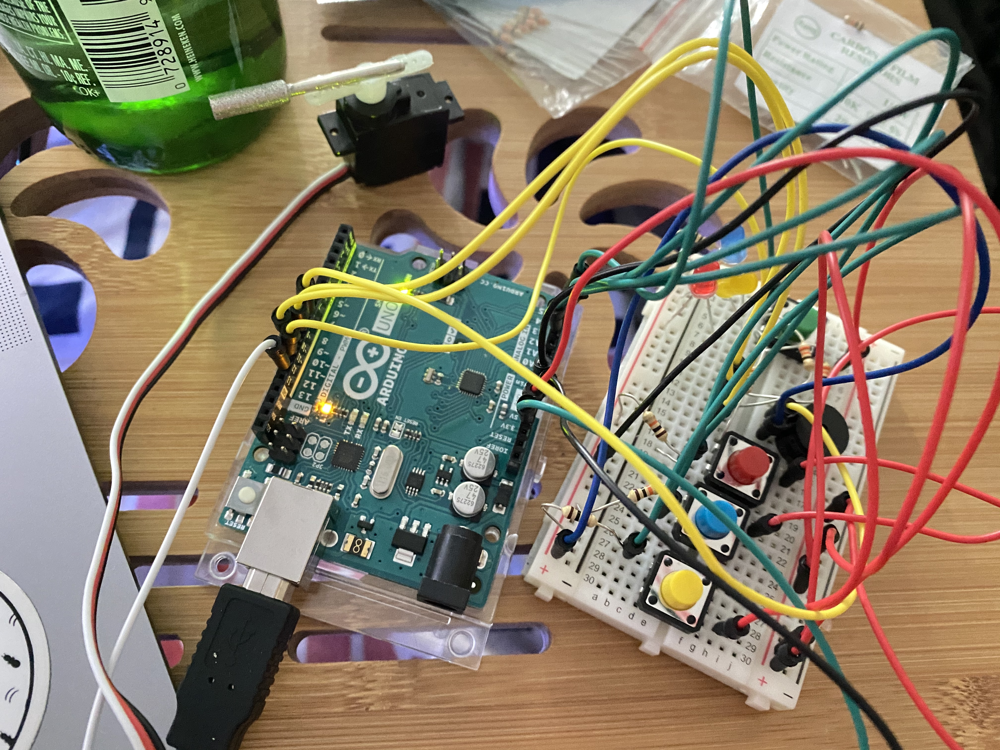
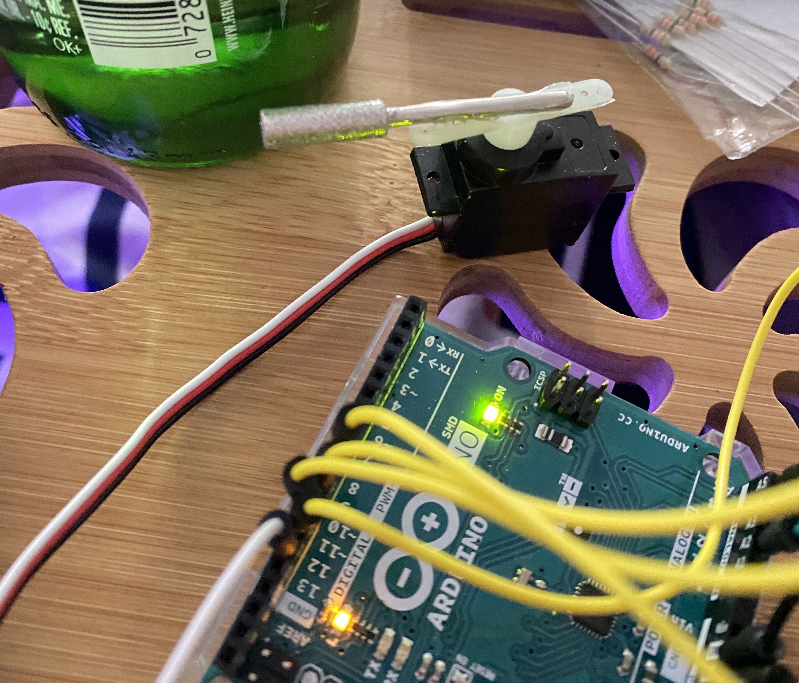
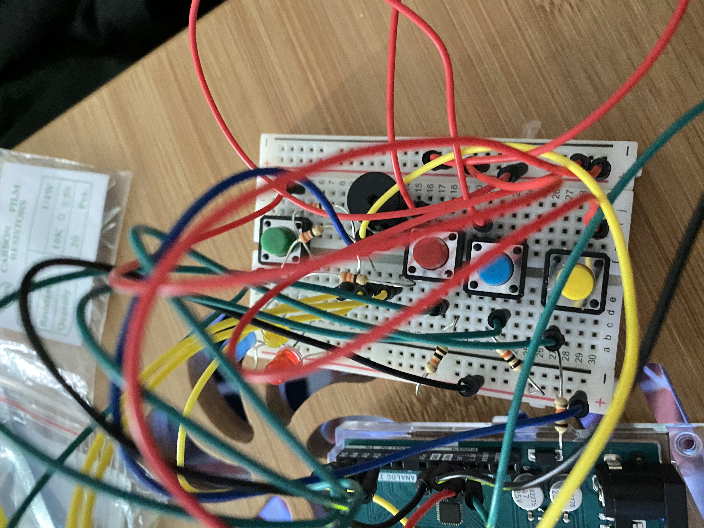
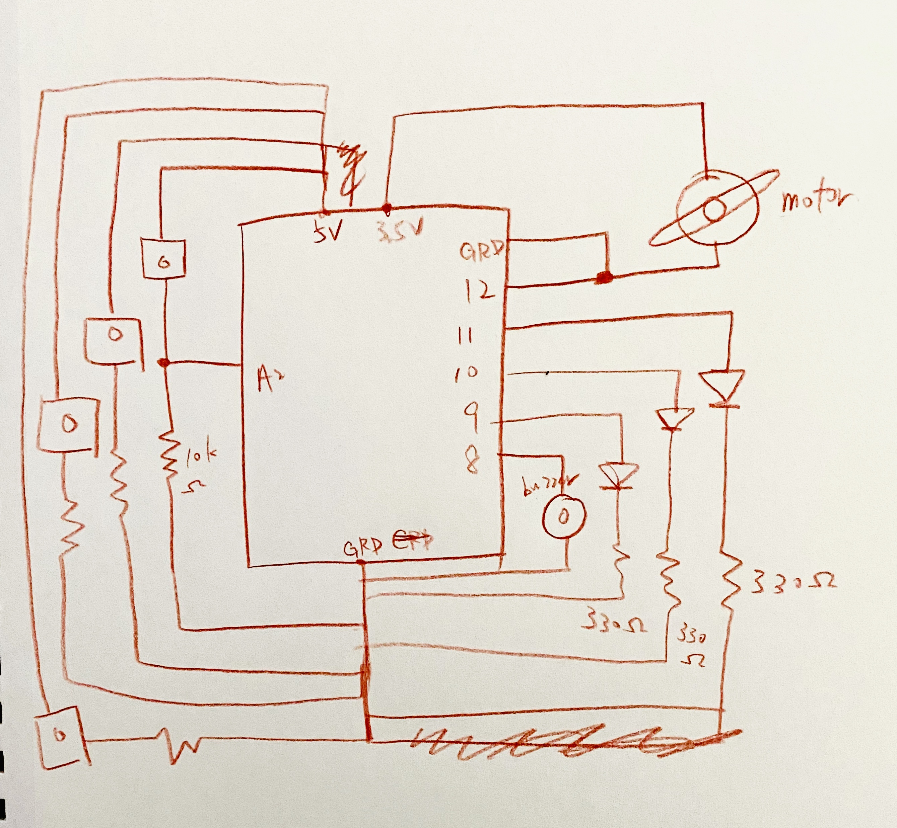

**Assignment 5 - Musical Instrument **

For this assignment, I try to make a muscial instrument that also lights up. The circuit consists of 3 LED bulbs and 4 switches. 3 of the switches corresponds to 3 different notes and each of them will light up a different bulb. For the fourth switch, it lights up all 3 bulbs ramdomly and plays a random note each time a different light bulb is on. The motor is connected to a metal bar that repeatedly hit on a glass bottle to create notes. 

**Set up of the circuit**

Complete setup

Motor setup

Breadboard setup

**How it works**

https://youtu.be/xGUsuMqLyn4

**Schematic**

**Method**

I started with connectinig the 3 light bulbs and the switches. Then, I connected these to the buzzer. In the code, whenever the switch is on, both the LED and buzzer will be turned on. I also wrote a function for the servo's rotation, which is called in the beginning of loop(). A random function is used to choose musics notes from an array for the fourth switch.

**Difficulties**

It was difficult to get 1)servo rotating, 2)LED lit up, and 3)the tunes playing all at the same time. I believe it is because of the for loops. Right now, when the servo rotates, it disrupts the tune/LED a slight bit eveen though I am not using delay() in my code. It was also difficult to just get everything on there without accidentally connecting circuits/have the metal touching and disrupts the circuit as the breadboard is relatively small.
