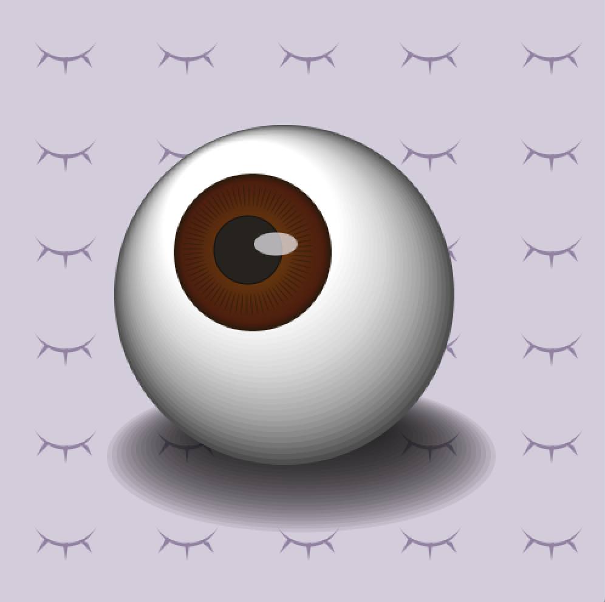

**Assignment 2 - Create an artwork using loops and transformation**

**Inspirations**

For this assignment, I did not want to view other artwork and wanted to come up with an idea on my own first. 
(I did look at them after I came up with an idea tho) Since we need to use for loops, I started to think about the possibility 
of mimicking gradient by using loops and modifying the color value and size. I started to think about what object would be best to practice this.
I thought something spheric would work very well, but a plain ball or even orange would be quite boring. Eyeball is spherical and have some degree of details to it.
Even though there are more elements than just a ball, things like the pupil is still circular and will not be too difficult to create a gradient effect for.
Therefore, I chose to go with an eyeball. To apply transformation, I decided to make a simple closed-eye symbol and translate it repeated it on the canvas.

**Rules I used to create this artwork**
I used three main strategy to create this. First, I used the function translate() and a while loop to create the eye pattern on the background. Second, I used
a while loop to create all the graident effects by modifying the color and size value in the loop. Lastly, I also used the rotate() function to achieve the detailings in the eye. 

**Difficulties**
It was difficult to get the eyelashs on the background right. I tried to make the left lash and right lash symmetrical by calculating where precisely they will need to be, but I keep messing up the math and I eventually decided to eyeball it(no pun intended). Another difficulty is that when I was trying to draw the shadow, I set the opacity to 20 and wanted to create the shadow by slowly decreasing the size and overlapping these circles. The opacity somehow doesn't work on the default background - the parts that are not fully opague somehow shows up black. I worked around this by drawing a 500x500 square on the background as my background.
