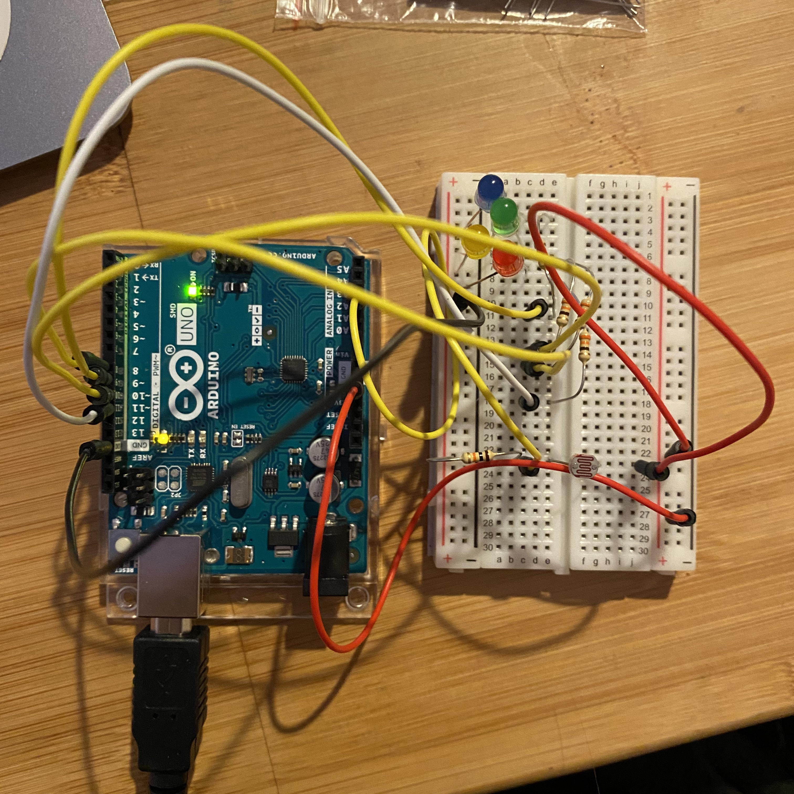

**Assignment 4 - getting started with Arduino**

For this assignment, I wanted to make something that looks more festive and fun. I decided to create this by using a photoresistor to turn on different
colors of LED lights randomly. The LED lights will also be blinking when they are turned on. I decided to have the lights turn on when it's dark because I feel like that makes more sense. 

**Set up of the circuit**

**How it works**

As you can see in the gif, the lights turn on randomly when my hand cover the photoresistor. 

**How it looks under dim lighting**

**Method**
I did the blinking part with the help of the blinking without delay tutorial. I also used a random function to generate a random number for the slots to create the random effect.

**Difficulties**
I originally wanted to do fading instead of blinking, but I wasn't able to figure out how to fade without using the delay function. 
