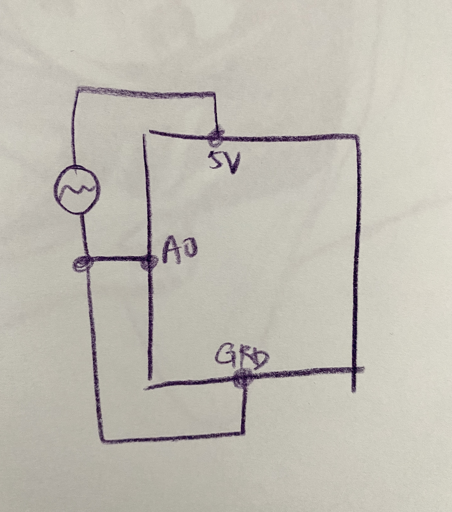

**July 29th - Communicating between Arduino and Processing**

For this assignment, I decided to implement a new element in my midterm project that allows the user to choose their paintbrush sizes. In order to do this, I used a potentiometer to act as the controller of paintbrush size.

**Demonstration**

Here is the regular size of the brush.

When you turn the potentiometer, it becomes smaller/bigger.

**Breadboard Photo**

**Schematic**

**Difficulties encountered**

This assignment was more difficult than I thought. I originally wanted to also connect some switches to my midterm projects to act as controllers of the paint brush color. However, I couldn't figure it out and decided to leave that part out. I was able to get the switches to print out their status when they are on, but I couldn't figure out how to get processing to do what I wanted it to with that information.
