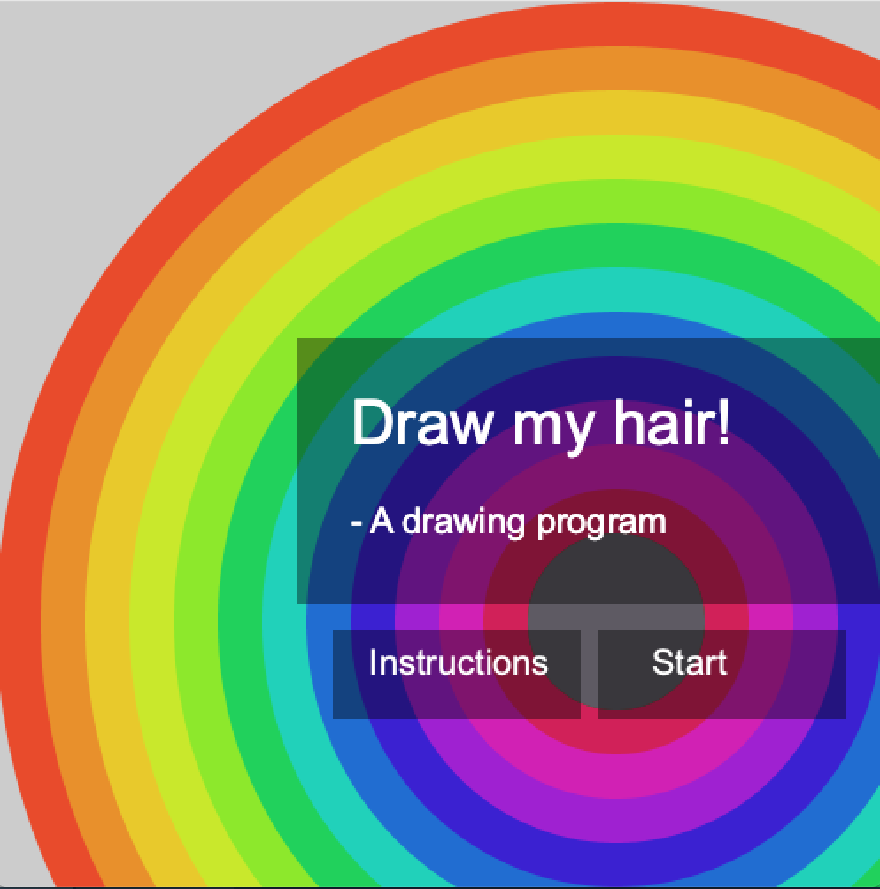
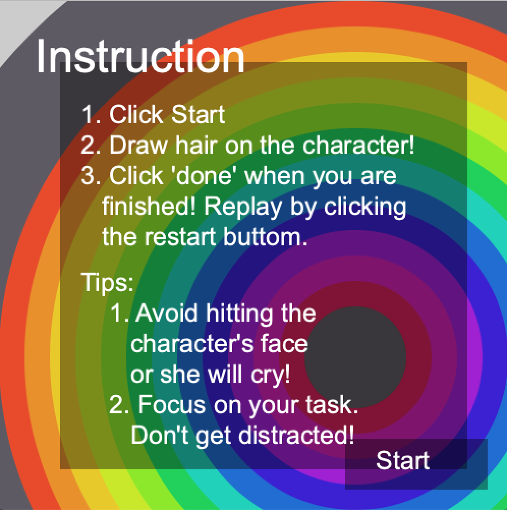
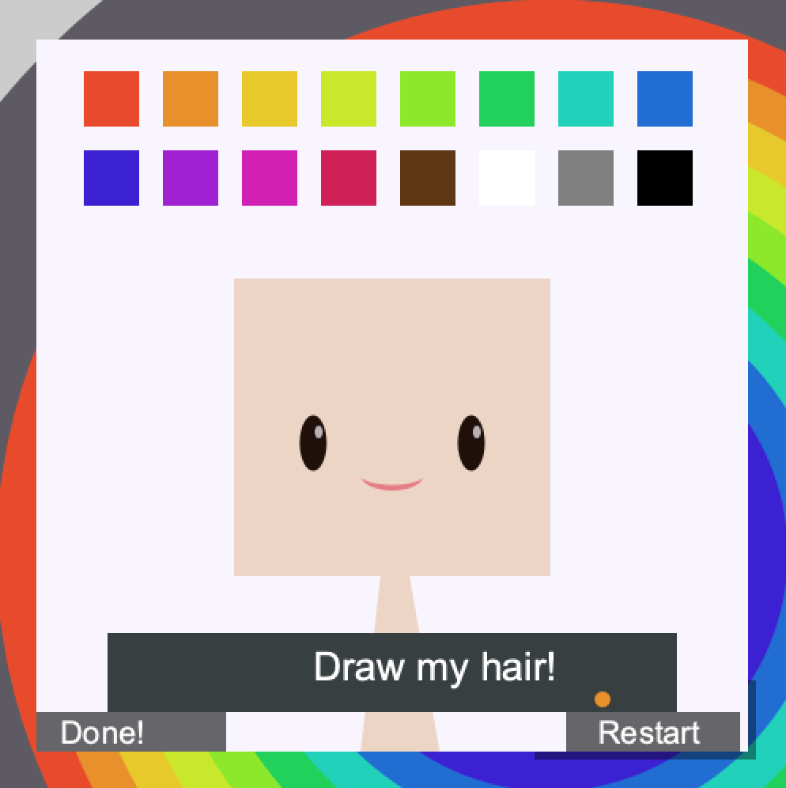
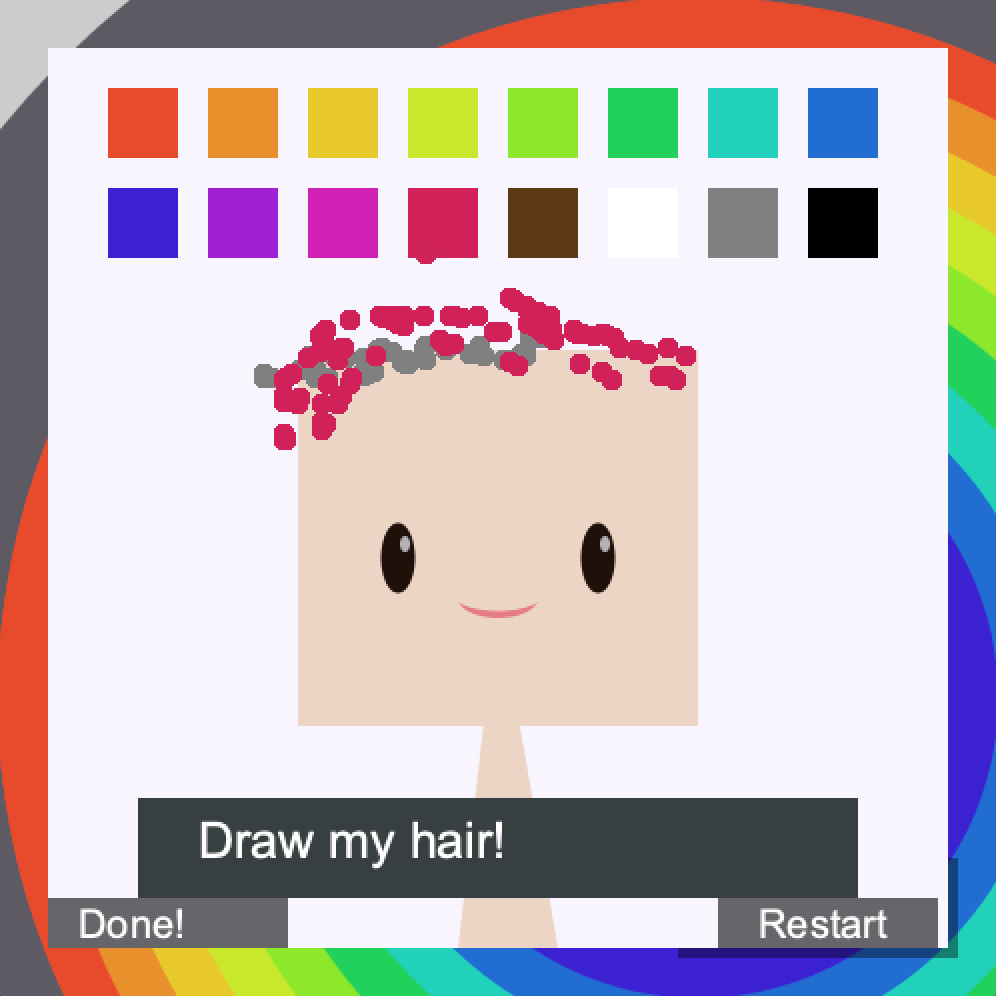
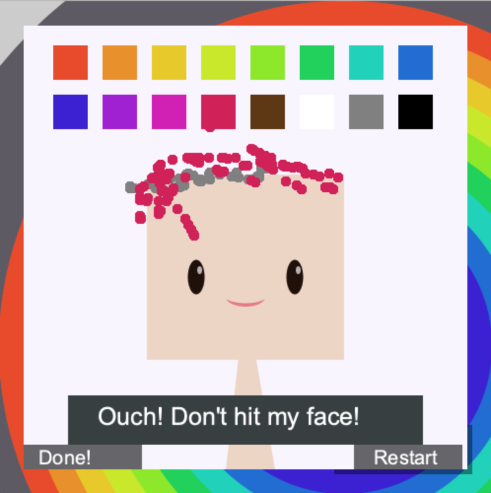
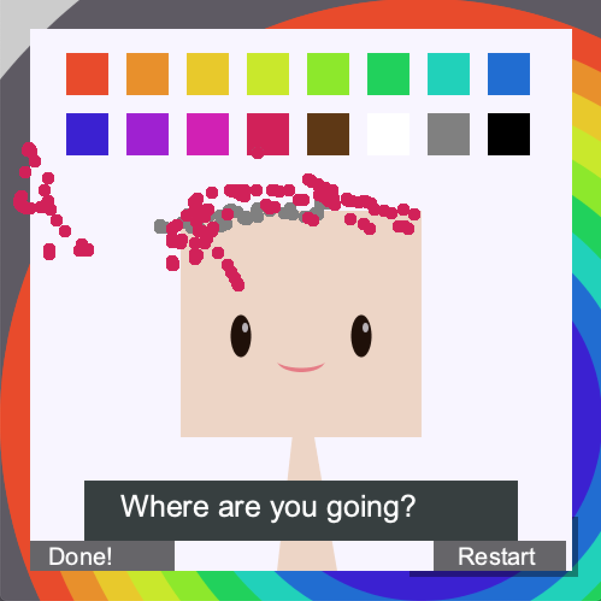
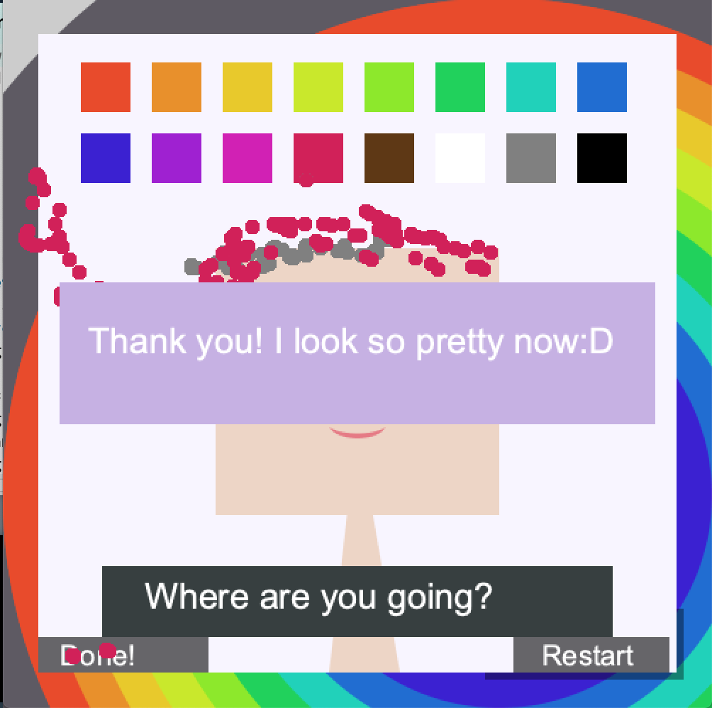

**Midterm Project**

**My improvements to the project**

In order to improve my paint program project, I made the following addtion/modification to my program:

* A home page that consists of the game name and two menu options: "Instructions" and "Start"

* An Instruction page that contains the instructions and game tips, and also a button to start the game immediately

* Background music

* New sound effects: when you touch the character's face or go too far away from her head, a child crying sound wll play; When you finish the game, there will be a cheering sound effect

* When you finish the game, a Thank You message from the girl will pop up along with sound effect

* You can now also restart the game immediately after playing by clicking the restart button

* Modifciation to the brush shape - It was changed from a square shape to a circle as I find that to be a better shape to draw with

* Codes are now *much more* organized. They are now split into different classes and redundant codes have been shortened and replaced by functions.

**Screenshot of different pages**

**A short video to demonstrate how it works**

https://youtu.be/KKwPut7047c

**Method, difficulties encountered**

I started by adding the background music and suond effects as thse are the most straightforward ones. I used the sound library to achieve this. Then, I created all the other landing pages on a separate processing file to ensure that they look good visually without moving my original codes. After that, I moved those codes into the project and sorted them into classes and functions. The most difficult part was to figure out where to place these functions. Since my program is drawing over an existing image, what I am essentially doing on the backend is storing the pixel information into an array every instant and update every pixel with the array at the same time. Because of this, my draw function keeps looping through the pixel and it makes it difficult to get things to show up properly. When I placed my function that draws the home page on the wrong line, sometimes part of the page will disappear after clicking on it once. I eventually figured it out with trial & errors. It was a difficult and fun experience.

